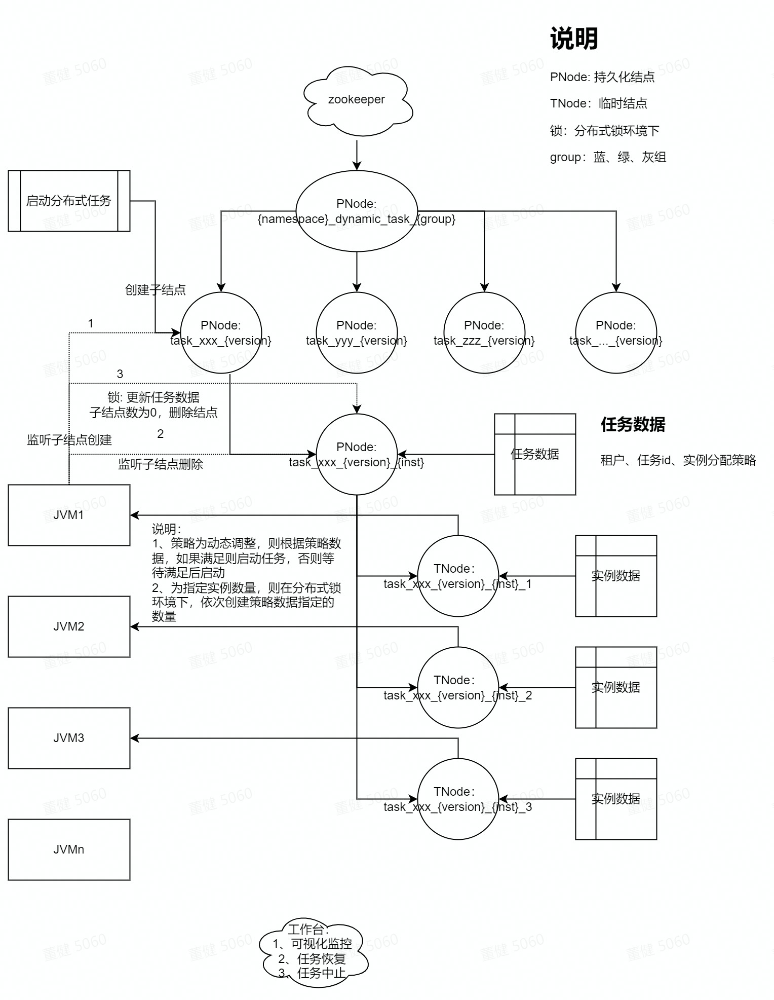
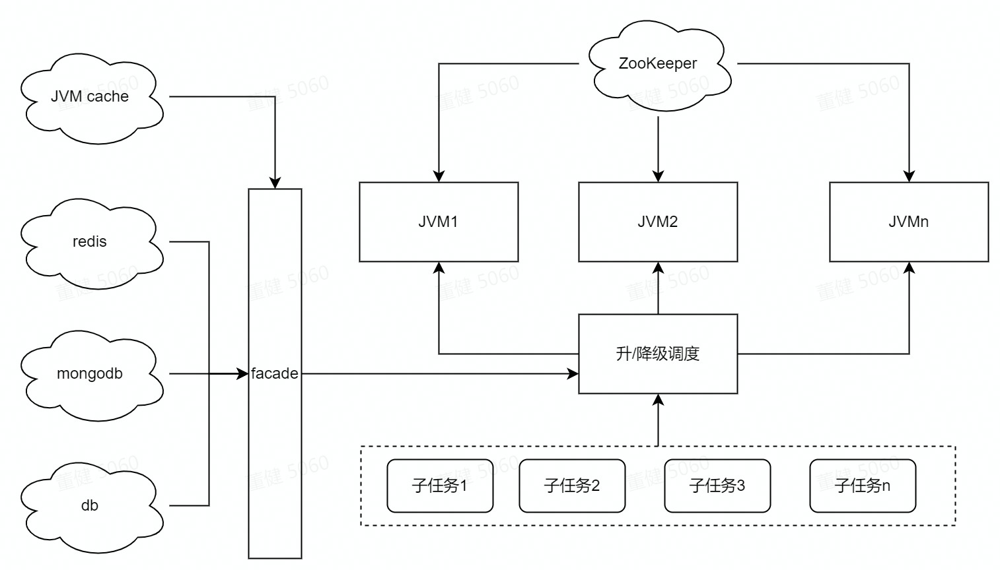

# ddtd

动态分布式任务调度（Dynamic-Distributed-Task-Dispatcher），包含动态组件构建的任务工作台，当然也可以仅使用调度，构建自己的前端

## 设计图
* 整体流程图

* 升降级机制设计
    - 当分布式调度所需组件失效，为了保证业务依然能正常进行，需要对分布式调度流程进行降级，变成单机任务执行。
    - 当降级执行任务，可根据策略配置进行自/手动升级，重新对剩余任务进行分布式执行


## 作用
ddtd主要作用是根据大任务拆分为小任务后，调度多个JVM实例进行小任务处理，并提供任务执行监控、任务恢复、任务中止、任务降/升级等，旨在提高大任务
的执行效率，且能可视化监控整个任务执行中的情况，提供API能有效的介入任务处理。

## 使用场景
* 大任务，无法使用或使用单JVM处理性能低下
* 关键任务，需要详细监控和介入
* 资源紧张，需要随时动态调整JVM并发数量

## 用法
* 引入
```xml
<dependency>
    <groupId>org.dragonfly</groupId>
    <artifactId>ddtd</artifactId>
    <version>0.0.1-SNAPSHOT</version>
</dependency>
```
* 关键类